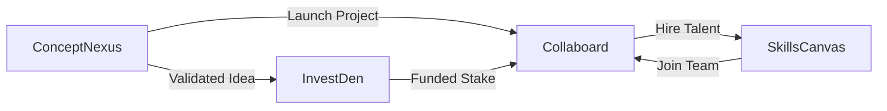

# Fixars Superapp - Product Requirements Document

## Executive Summary

**Fixars** is a unified productivity superapp that brings together investing, idea validation, project collaboration, and talent sourcing under one seamless ecosystem. The platform enables ideas to flow freely between four interconnected sub-apps, creating a complete lifecycle from concept to execution.

## Vision Statement

> Create an interconnected world where ideas flow freely between apps—where a validated concept in ConceptNexus can instantly become a funded stake in InvestDen, be executed on Collaboard, and staffed from SkillsCanvas—all with a single login and a unified points system that rewards every action.

---

## Platform Architecture

### Core Platform Features

| Feature | Description |
|---------|-------------|
| **Unified Authentication** | Single sign-on across all sub-apps via Supabase |
| **Cross-App Data Sharing** | Shared DataContext enabling seamless data flow between apps |
| **Points System** | Gamified reward system (FixPoints) for platform engagement |
| **Social Feed** | Unified activity feed aggregating actions across all apps |
| **User Dashboard** | Centralized hub for managing activities across all sub-apps |

### Technology Stack

- **Frontend**: React 18 + Vite
- **Routing**: React Router DOM
- **Styling**: Vanilla CSS with custom design system
- **Backend**: Supabase (Auth, Database, Realtime)
- **UI Components**: Custom component library (shadcn/ui-inspired)

---

## Sub-Apps Overview

### 1. InvestDen 💹

**Purpose**: Crowdfunding and staking platform for innovative ideas and projects.

#### Key Features
- **Create Stakes**: Users can create investment opportunities with defined targets, risk levels, and expected returns
- **Stake Management**: Track portfolio, active stakes, and ROI projections
- **Risk Assessment**: Categorized risk levels (Low, Medium, High) with visual indicators
- **Progress Tracking**: Real-time funding progress with stakeholder visibility

#### Core Functionality
```
├── Stake Creation & Management
├── Portfolio Dashboard
├── Investment Discovery (Tech, Marketplace, Health categories)
├── Staker Tracking & Returns Calculation
└── Cross-app linking to funded Ideas
```

#### User Stories
- As an investor, I want to discover and stake on promising ideas
- As a project creator, I want to raise funds through community investment
- As a stakeholder, I want to track my portfolio performance

---

### 2. ConceptNexus 💡

**Purpose**: Community-driven idea validation and feedback platform.

#### Key Features
- **Idea Submission**: Rich idea creation with descriptions and impact tags
- **Community Voting**: Upvote/downvote system for idea validation
- **Validation Status**: Track idea progression (Draft → Validating → Validated)
- **Cross-App Launch**: Send validated ideas to InvestDen (funding) or Collaboard (execution)

#### Core Functionality
```
├── Idea Creation & Editing
├── Upvote/Downvote Voting System
├── Validation Tracking
├── Impact Categorization (environmental, community, tech, etc.)
├── Comments & Discussions
└── Launch to InvestDen / Collaboard
```

#### User Stories
- As an innovator, I want to submit and validate my ideas with the community
- As a community member, I want to vote on ideas I believe in
- As a validated idea owner, I want to convert my idea into a funded project

---

### 3. Collaboard 📋

**Purpose**: Project management and team collaboration with Kanban boards.

#### Key Features
- **Board Creation**: Create project boards with customizable columns
- **Task Management**: Comprehensive task cards with assignees, due dates, and labels
- **Team Collaboration**: Multi-member boards with role-based access
- **Linked Ideas**: Connect boards to ConceptNexus ideas for traceability
- **Agreements System**: Team agreements and milestones tracking

#### Core Functionality
```
├── Kanban Board Management
├── Task Creation, Assignment & Tracking
├── Column Customization (Todo, In Progress, Done, etc.)
├── Member Management & Invitations
├── Linked Idea Tracking
├── Agreement Signing
└── Due Date & Label System
```

#### User Stories
- As a project lead, I want to create boards to organize team work
- As a team member, I want to see my assigned tasks and update progress
- As a stakeholder, I want to track execution of funded ideas

---

### 4. SkillsCanvas 🎨

**Purpose**: Talent marketplace connecting skilled professionals with project needs.

#### Key Features
- **Talent Profiles**: Comprehensive profiles with skills, ratings, and portfolio
- **Skill Categories**: Expert, Advanced, Intermediate, Beginner classifications
- **Search & Discovery**: Filter talents by skills, availability, and hourly rate
- **Contact System**: Direct connection with talent for project collaboration
- **Review System**: Ratings and reviews from completed projects

#### Core Functionality
```
├── Talent Profile Management
├── Skill Assessment & Verification
├── Portfolio Showcase
├── Search & Filter System
├── Contact & Booking
├── Rating & Review System
└── Hourly Rate Management
```

#### User Stories
- As a talent, I want to showcase my skills and find project opportunities
- As a project owner, I want to find and hire the right talent for my team
- As a client, I want to review talent performance after project completion

---

## Cross-App Integration Features

### Project Lifecycle Flow



### Integration Actions

| Action | Source App | Target App | Description |
|--------|-----------|------------|-------------|
| **Launch to InvestDen** | ConceptNexus | InvestDen | Convert validated idea to funding stake |
| **Launch to Collaboard** | ConceptNexus | Collaboard | Create execution board from idea |
| **Hire from SkillsCanvas** | Collaboard | SkillsCanvas | Browse and add talent to project |
| **Link Stake to Board** | InvestDen | Collaboard | Connect funded stake to execution board |

---

## Points System (FixPoints)

### Earning Actions

| Action | Points | App |
|--------|--------|-----|
| Submit Idea | +10 | ConceptNexus |
| Vote on Idea | +2 | ConceptNexus |
| Idea Gets Validated | +50 | ConceptNexus |
| Create Stake | +15 | InvestDen |
| Stake on Project | +5 | InvestDen |
| Complete Task | +5 | Collaboard |
| Complete Profile | +20 | SkillsCanvas |
| Receive Review | +10 | SkillsCanvas |

### Point Tiers
- **Bronze**: 0 - 499 points
- **Silver**: 500 - 1,999 points
- **Gold**: 2,000 - 4,999 points
- **Platinum**: 5,000+ points

---

## Technical Requirements

### Performance Targets
- **First Contentful Paint**: < 1.5s
- **Time to Interactive**: < 3s
- **API Response Time**: < 200ms

### Security Requirements
- Row Level Security (RLS) via Supabase
- Secure session management
- Input validation on all forms
- XSS prevention

### Scalability
- Serverless architecture via Supabase
- Lazy loading for sub-apps
- Optimistic UI updates

---

## Roadmap

### Phase 1: Foundation (Complete ✅)
- [x] Core platform architecture
- [x] Authentication system
- [x] All four sub-apps with basic functionality
- [x] Mock data integration
- [x] Points system

### Phase 2: Cross-App Integration (In Progress 🔄)
- [x] Cross-App Project Launch
- [ ] Unified Search across apps
- [ ] Real-time notifications
- [ ] Enhanced social feed

### Phase 3: Backend Integration
- [ ] Full Supabase integration for all apps
- [ ] Real-time collaboration features
- [ ] Payment processing for InvestDen
- [ ] Talent booking system

### Phase 4: Advanced Features
- [ ] AI-powered idea recommendations
- [ ] Advanced analytics dashboard
- [ ] Mobile application
- [ ] API for third-party integrations

---

## Success Metrics

| Metric | Target |
|--------|--------|
| Monthly Active Users | 10,000+ |
| Ideas Validated | 500/month |
| Projects Funded | 50/month |
| Tasks Completed | 5,000/month |
| Talent Hired | 200/month |
| Cross-App Actions | 1,000/month |

---

## Appendix

### Data Models

```
User
├── id, email, displayName
├── avatar, bio
└── pointsBalance, tier

Stake (InvestDen)
├── id, title, description
├── targetAmount, currentAmount
├── riskLevel, expectedReturns
├── stakers[], deadline, status
└── linkedIdeaId

Idea (ConceptNexus)
├── id, title, description
├── creatorId, validators[]
├── upvotes, downvotes
├── status, impactTags[]
└── linkedStakeId, linkedBoardId

Board (Collaboard)
├── id, title, description
├── creatorId, members[]
├── columns[], linkedIdeaId
└── agreements[]

Talent (SkillsCanvas)
├── id, userId, displayName
├── skills[], hourlyRate
├── rating, reviewCount
└── portfolio, availability
```

---

*Document Version: 1.0*  
*Last Updated: January 2026*
