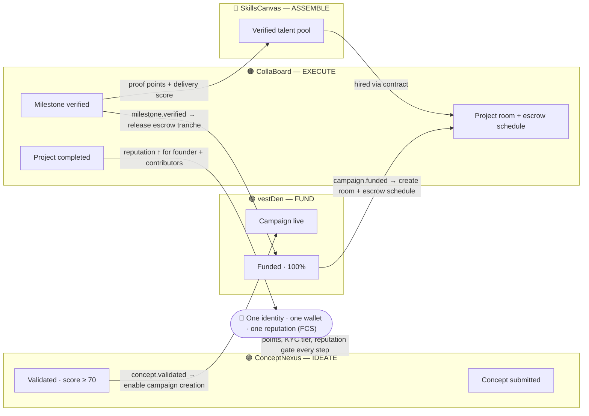
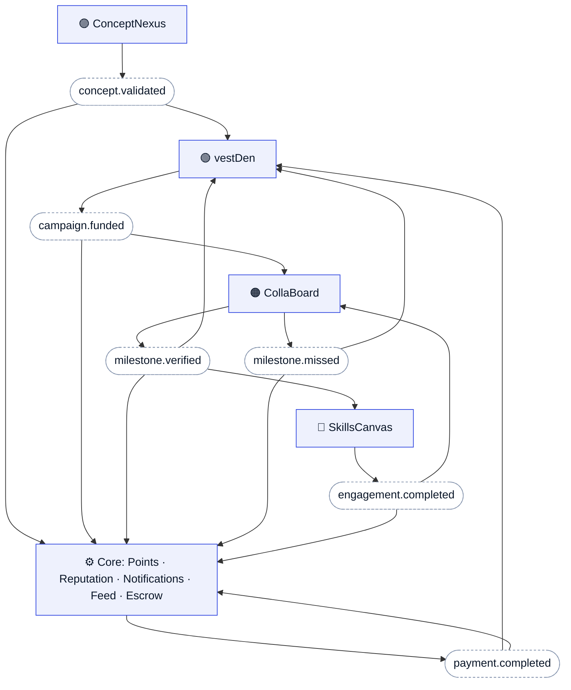
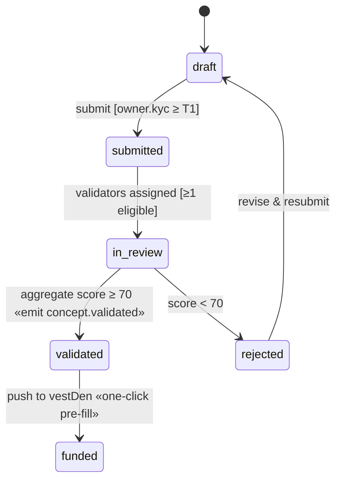
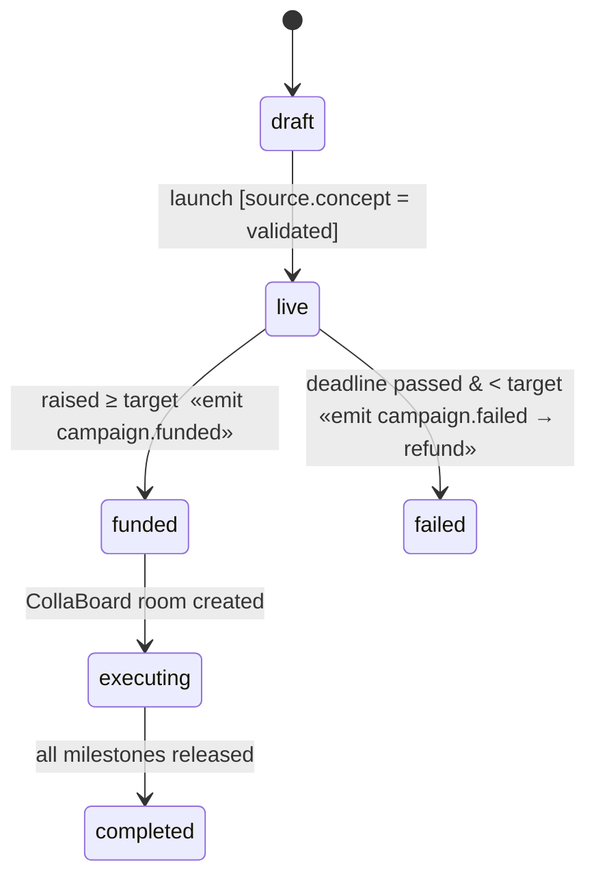
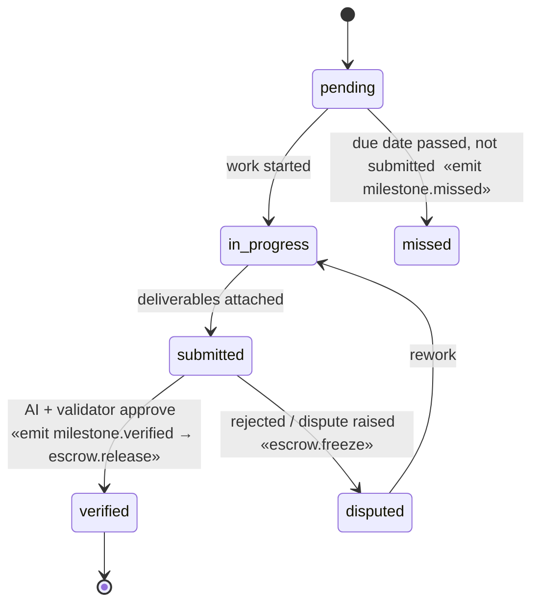
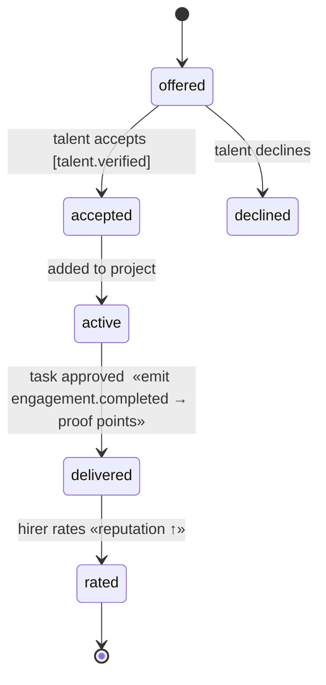

# Fixars Ecosystem — Visual Webbing (pre‑AI)

Three views of one model. The **journey** shows the happy path; the **event webbing**
shows what fires what; the **state machines** show the guarded steps inside each app.
Guards in `[brackets]` are the deterministic conditions (pre‑AI).

---

## View 1 — The Innovation Journey (how the dots connect)

---

## View 2 — Event Webbing (publisher → event → subscribers)

This is the literal "webbing": every line is a subscription. The engine is just this table made runnable.

---

## View 3 — State Machines (the guarded steps inside each app)

The cross‑app triggers above are emitted **on the bold transitions** here.

### Concept (ConceptNexus)

### Campaign (vestDen)

### Milestone (CollaBoard ↔ escrow)

### Engagement (SkillsCanvas → CollaBoard)

---

## Reading the webbing as rules (preview of the algo layer)

Each subscription line above is one row of `WHEN event → IF guard → THEN actions`:

| WHEN (event) | IF (guard) | THEN (actions) |
|---|---|---|
| `concept.validated` | `score ≥ 70 ∧ owner.kyc ≥ T1` | enable campaign creation · award points · post to feed |
| `campaign.funded` | `raised ≥ target` | create CollaBoard room · build escrow schedule · notify investors |
| `milestone.verified` | `approvals ≥ quorum` | release escrow tranche · add SkillsCanvas proof points · resolve conviction market = YES |
| `milestone.missed` | `now > due ∧ status ≠ submitted` | resolve conviction market = NO · flag project risk |
| `engagement.completed` | `task.status = approved` | award points · update delivery score · update reputation |

Two invariants the algo must enforce on every row: **idempotency** (safe to run twice — events get redelivered) and **compensation** (a defined undo path, e.g. `campaign.failed → refund all investors`).
